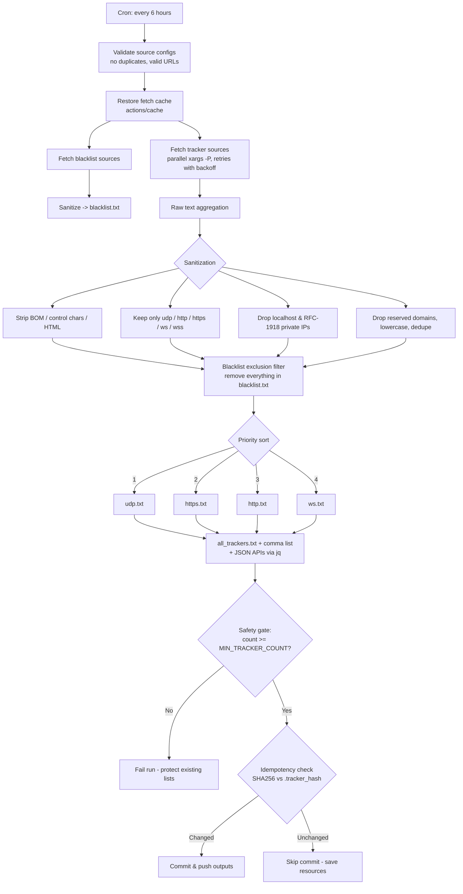

# 🏛️ System Architecture

Architectural overview of the **Ultimate Torrent Tracker Aggregator** — how the pipeline fetches, filters, and distributes BitTorrent trackers every 6 hours.

## 🧩 Core Design Principle: Single Source of Truth

All aggregation logic lives in **one script**: [`scripts/update.sh`](../scripts/update.sh).
GitHub Actions, Docker, the Makefile, and the test suite all execute this same code — so what you test locally is exactly what runs in production.

| Component | Responsibility |
| --- | --- |
| `scripts/update.sh` | The engine: fetch → sanitize → blacklist-filter → sort → publish |
| `config/sources.txt` | List of good-tracker source URLs (config, not code) |
| `config/blacklist_sources.txt` | Known-bad tracker sources used for exclusion |
| `.github/workflows/update-trackers.yml` | Scheduler: runs the engine every 6 hours, commits results |
| `tests/tracker_test.bats` | Verifies every filtering rule of the engine |
| `Dockerfile` / `docker-compose.yml` | Self-hosted one-shot runs of the same engine |

## 🔄 The Pipeline Flow

## 🛡️ Safety Mechanisms

1. **Validation first:** malformed or duplicate source URLs fail the run before any fetching starts.
2. **Blacklist exclusion:** known-bad trackers (from `config/blacklist_sources.txt`) are published to `blacklist.txt` and can never appear in the final lists.
3. **Minimum count gate:** if upstream sources collapse and the result is too small (`MIN_TRACKER_COUNT`), the run fails instead of overwriting good lists with a degraded one.
4. **Idempotency:** a SHA256 hash comparison prevents empty "update" commits when nothing changed.
5. **No silent failures:** fetch failures are logged per-source; commit/push errors fail the workflow loudly and trigger the Discord alert.

## 📤 Published Outputs

| File | Format | Use case |
| --- | --- | --- |
| `all_trackers.txt` | One tracker per line, blank-line separated | qBittorrent, Transmission, Deluge |
| `all_trackers_comma.txt` | Comma-separated single line | Aria2 (`bt-tracker=`) |
| `udp.txt` / `https.txt` / `http.txt` / `ws.txt` | Per-protocol lists | Protocol-restricted setups |
| `blacklist.txt` | Known-bad trackers | Client-side exclusion |
| `api/stats.json` | Run statistics | Dashboards, monitoring |
| `api/badge.json` | Shields.io endpoint | README badge |
| `api/trackers.json` | Full list as JSON array | Programmatic consumers |

## ⚙️ Supporting Workflows

| Workflow | Trigger | Purpose |
| --- | --- | --- |
| `update-trackers.yml` | Cron / manual | The main engine run |
| `lint.yml` | Push / PR | ShellCheck + bats test suite |
| `checksum.yml` | `.txt` pushes | Regenerates `SHA256SUMS.txt` |
| `discord-alert.yml` | Engine failure | Failure notification |
| `release.yml` + `sign-artifacts.yml` | Tags / releases | Zipped, Sigstore-signed release assets |
| `sbom.yml` | Push / release | Software Bill of Materials |
